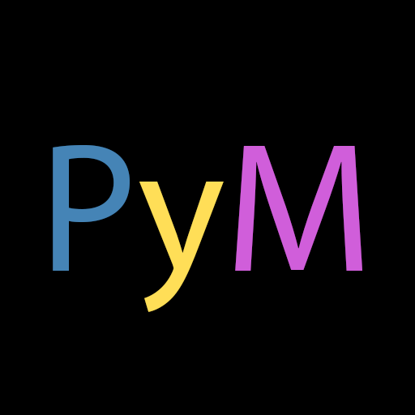

# PerceiveYourMeme (PyM)




[](https://github.com/dinhanhx)

## What is this?

A Python library to scrap from [KnowYourMeme](https://knowyourmeme.com/). Written in Python 3.7!

## How to set up this library?

Before setting up this library, it is recommended to checkout this file `PerceiveYourMeme/CONST.py`, there are 2 constants you may want to modify.

```Python
HEADERS = {'User-Agent':'Mozilla/5.0 (Windows NT 10.0; Win64; x64) AppleWebKit/537.36 (KHTML, like Gecko) Chrome/85.0.4183.83 Safari/537.36 Edg/85.0.564.44'}
# User-Agent headers
# This HEADERS can be achieved by going to this link
# https://www.whatismybrowser.com/detect/what-is-my-user-agent
# If you are smart and have time, https://developers.whatismybrowser.com/api/

DEFAULT_DOWNLOAD_PATH = ''
# Define default download path
# This depends on OS
# If you are smart and have time, https://stackoverflow.com/questions/35851281/python-finding-the-users-downloads-folder
```

Clone this repository and run this command at root

`pip install -r req.txt .` (The last parameter is a dot `.`)

## How to use this library?

Since I am too busy to checkout at [readthedocs](https://readthedocs.org/), so please checkout `DOCUMENTATION.md`

## What are applications of this library?
- For archiving memes data from KnowYourMeme (Obviously)
- For building dataset for memes detection such as [Memes Detection Android App using Deep Learning](https://medium.com/datadriveninvestor/memes-detection-android-app-using-deep-learning-d2c65347e6f3) or [Hateful Memes Challenge and data set for research on harmful multimodal content](https://ai.facebook.com/blog/hateful-memes-challenge-and-data-set/)
- For entertaining purposes such as a discord meme bot (TBH Reddit is still better source for getting memes)

If you use this library for different purposes from mentioned one, it is recommended to add your purposes and links to your project to this section.
